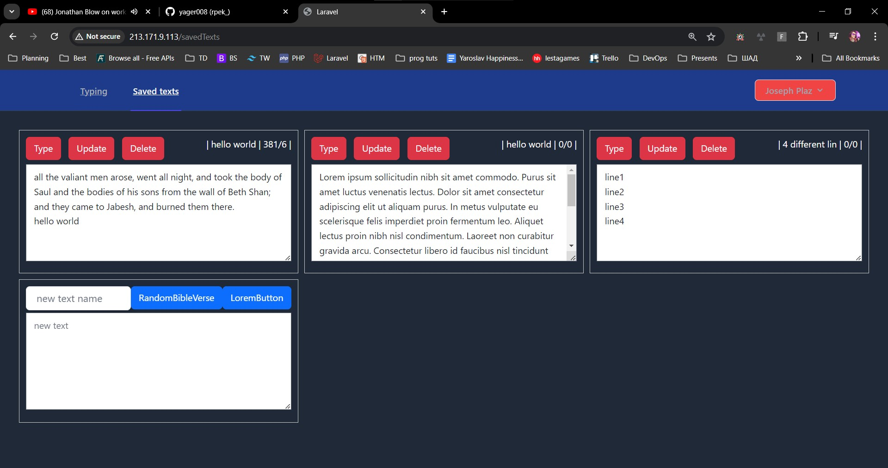

First time setup:
1. docker compose up --build
2. create env file
   DB_CONNECTION = mysql  
   DB_PORT = 3306  
   DB_HOST = db  
   DB_PASSWORD  
3. app/composer install
4. app/php artisan key:generate
5. app/chmod 777 -R ./
6. app/php artisan migrate
7. app/npm install
8. app/npm run build
9. cp /var/www/public/.vite/manifest.json /var/www/public/manifest.json

if locally:
9. Start vite: npm run dev -- --host 0.0.0.0

Next time setup:
1. docker compose up --build
2. docker exec -it app bash/npm run dev -- --host 0.0.0.0

SEEDER (when user with id 1 already exists):  
php artisan db:seed --class=SavedTextsTableSeeder  
php artisan db:seed --class=TypeResultsTableSeeder

Breeze:
composer require laravel/breeze --dev
php artisan breeze:install
php artisan migrate
npm install
npm run dev

